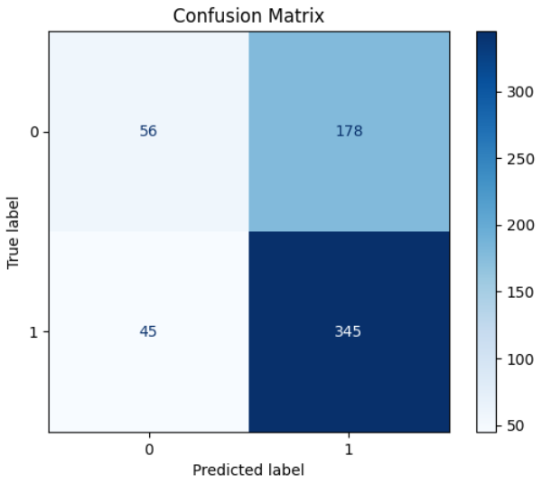

# Pneumonia Detection Using CNN

This project utilizes a Convolutional Neural Network (CNN) to detect pneumonia from chest X-ray images. The dataset used includes labeled images of chest X-rays classified as either 'NORMAL' or 'PNEUMONIA'.

## Table of Contents
1. [Project Overview](#project-overview)
2. [Dataset Description](#dataset-description)
3. [Dependencies and Setup](#dependencies-and-setup)
4. [Model Architecture](#model-architecture)
5. [Training and Evaluation](#training-and-evaluation)
6. [Results](#results)
7. [Visualization](#visualization)
8. [Conclusion](#conclusion)

---

## Project Overview
This project aims to develop a deep learning model capable of detecting pneumonia in chest X-ray images. The model was trained and evaluated on the [Chest X-Ray Images](https://www.kaggle.com/code/homayoonkhadivi/medical-diagnosis-with-cnn-transfer-learning/input) dataset, leveraging CNNs for feature extraction and classification.

## Dataset Description
The dataset consists of chest X-ray images categorized into two classes:
- **NORMAL**: Images of healthy lungs.
- **PNEUMONIA**: Images of lungs infected with pneumonia.

### Directory Structure
- `train/`: Training images.
- `val/`: Validation images.
- `test/`: Testing images.

### Data Distribution
- **Training Set**:
  - PNEUMONIA: 5216 images
  - NORMAL: 1341 images
- **Validation Set**:
  - PNEUMONIA: 8 images
  - NORMAL: 8 images
- **Test Set**:
  - PNEUMONIA: 390 images
  - NORMAL: 234 images

## Dependencies and Setup
To run this project, the following libraries are required:
- TensorFlow
- PyTorch
- Matplotlib
- NumPy
- Pandas
- Scikit-learn

You can install these dependencies using the following command:
```bash
pip install tensorflow torch torchvision matplotlib numpy pandas scikit-learn
```

## Model Architecture
The CNN architecture consists of four convolutional layers with ReLU activations, batch normalization, and max-pooling. The model also uses dropout regularization to prevent overfitting.

### Layers
- **Convolutional Layers**: 4 layers with 16, 32, 64, and 128 filters respectively.
- **Pooling Layers**: Max pooling after each convolutional block.
- **Fully Connected Layers**: Two fully connected layers with dropout.

### Code Snippet:
```python
class XRayCNN(nn.Module):
    def __init__(self):
        super(XRayCNN, self).__init__()
        self.conv1 = nn.Conv2d(1, 16, kernel_size=3, stride=1, padding=1)
        self.conv2 = nn.Conv2d(16, 32, kernel_size=3, stride=1, padding=1)
        self.conv3 = nn.Conv2d(32, 64, kernel_size=3, stride=1, padding=1)
        self.conv4 = nn.Conv2d(64, 128, kernel_size=3, stride=1, padding=1)
        self.pool = nn.MaxPool2d(kernel_size=2, stride=2)
        self.global_pool = nn.AdaptiveAvgPool2d((1, 1))
        self.fc1 = nn.Linear(128, 128)
        self.fc2 = nn.Linear(128, 2)
        self.dropout = nn.Dropout(0.5)
        self.relu = nn.ReLU()

    def forward(self, x):
        x = self.pool(self.relu(self.conv1(x)))
        x = self.pool(self.relu(self.conv2(x)))
        x = self.pool(self.relu(self.conv3(x)))
        x = self.pool(self.relu(self.conv4(x)))
        x = self.global_pool(x)
        x = x.view(-1, 128)
        x = self.relu(self.fc1(x))
        x = self.dropout(x)
        x = self.fc2(x)
        return x
```

## Training and Evaluation
- **Optimizer**: Adam with a learning rate of 0.001.
- **Loss Function**: Cross-entropy loss.
- **Training Duration**: 10 epochs.
- **Batch Size**: 16.
- **Data Augmentation**: Applied random horizontal flip, rotation, and color jitter to enhance generalization.

### Performance Metrics:
- **Accuracy**
- **Loss**
- **AUC (Area Under Curve)**
- **Confusion Matrix**

## Results
The CNN model achieved the following performance:
- **Test Accuracy**: **89.74%**
- **AUC Score**: **0.925**

### Confusion Matrix:
The confusion matrix is used to visualize the performance of the classification model.


### ROC Curve:
The ROC curve illustrates the model's ability to discriminate between classes.


## Visualization
- **Loss Curve**: Displays the training loss over epochs.
- **Accuracy Curve**: Shows the training accuracy improvement over epochs.
- **Sample Images**: Examples of chest X-ray images from the dataset.

## Conclusion
This project demonstrates the potential of using Convolutional Neural Networks to detect pneumonia from chest X-ray images. With a test accuracy of 89.74% and an AUC of 0.925, the model shows promising results for real-world applications.

Further improvements can include:
- Using more advanced architectures like ResNet or DenseNet.
- Fine-tuning on larger datasets.
- Exploring transfer learning techniques.
